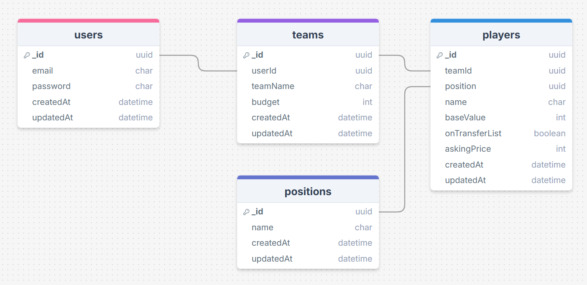

## This app is built using the following technologies:

- Football-Online-Manager uses the [React.js](https://react.dev/) library. React.js is a JavaScript library for building user interfaces (UIs), particularly for single-page applications (SPAs).

- For the database, Football-Online-Manager uses [MongoDB](https://www.mongodb.com), a widely used open-source NoSQL database management system.

- For the backend, Football-Online-Manager uses [Node.js](https://nodejs.org/en), an open-source, cross-platform JavaScript runtime environment that allows developers to execute server-side code using JavaScript.

<br>

## Database Design
MongoDB is like a digital storage space where we keep information. In this system, there are four main groups of information called collections. These collections are like folders for different types of things.

Inside each collection, there are documents. Documents are like individual files, and they store data in a format called BSON (Binary JSON).

- Users: This collection holds details about the people using the system.
- Teams: It contains information about the created teams for users.
- Players: It contains all the players inside the system.
- Positions: This is where we store players positions.

So, these collections help us organize and manage different types of information in MongoDB.



<br>

## How to Run :

### Prerequisites

Download [Node.js](https://nodejs.org/en)

- npm
  ```sh
  npm install npm@latest -g
  ```

### Installation

#### Website


1. Clone the repo
   git clone [github](https://github.com/Ahmad-Rammall/Football-Online-Manager.git)
   ```sh
   git clone https://github.com/Ahmad-Rammall/Football-Online-Manager.git
   ```
2. Install NPM packages
   ```sh
   cd Football-Online-Manager\frontend
   npm install
   ```
3. Create a .env file and add your API URL (I pushed .env files to the repository to make it easier and because it doesn't have critical data) :

   ```js
   VITE_REACT_APP_API_HOST=http://localhost:5000
   ```

4. Start server:
   ```sh
   npm run dev
   ```

#### Server

1. Navigate to backend directory:

   ```sh
   cd Football-Online-Manager\backend
   npm install
   ```

2. Install and run Redis server for [windows](https://github.com/tporadowski/redis/releases) or [linux](https://redis.io/docs/latest/operate/oss_and_stack/install/install-redis/install-redis-on-linux/)

3. Download and setup [MongoDB](https://www.mongodb.com/docs/manual/installation/)

4. Create a .env file and add:

   ```js
    PORT=5000
    MONGODB_URL=mongodb://localhost:27017/footballManager
    JWT_SECRET=(Generate a Key)
    REDIS_HOST=127.0.0.1
    REDIS_PORT=6379
   ```

5. Navigate to seeders folder and run following instructions, to create positions and players <br/>
<i>(This App doesn't create players when creating a team, player is predefined in the databse, and when a team is created, server assigns a teamId for players)</i>:

   ```sh
   cd Football-Online-Manager\backend\seeders
   node position.seeder.js
   node player.seeder.js
   ```

6. Run Server:
   ```sh
   npm run dev
   ```

Now, you should be able to run Football-Online-Manager locally and explore its features.

## Time Report
#### Database: 1 hour
#### Readme File: 1.5 hours 
#### Backend: 8 hours
#### Frontend: 15 hours
